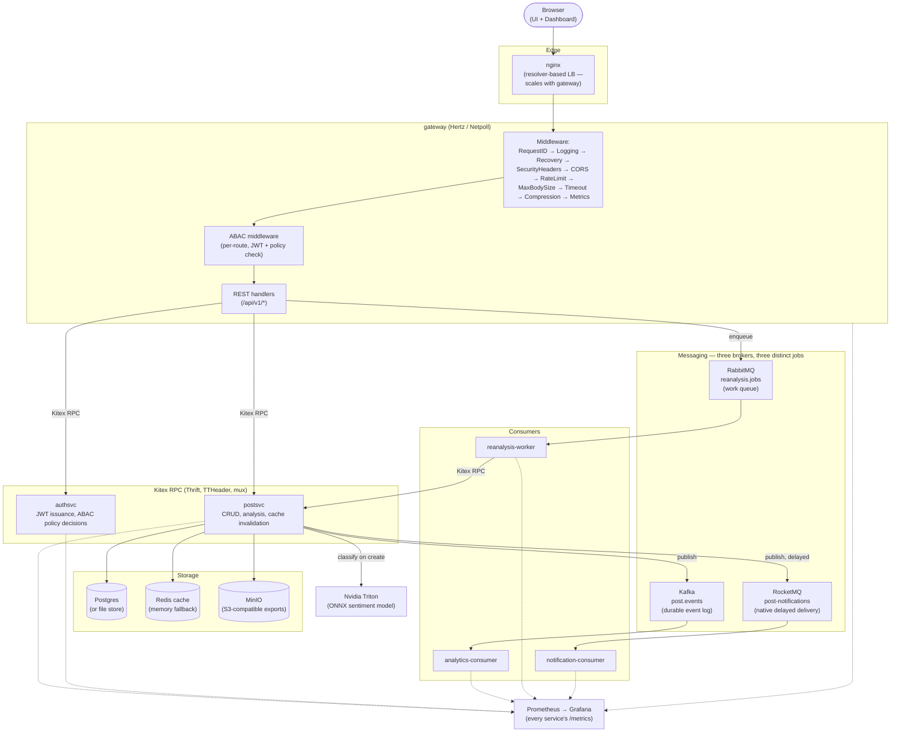
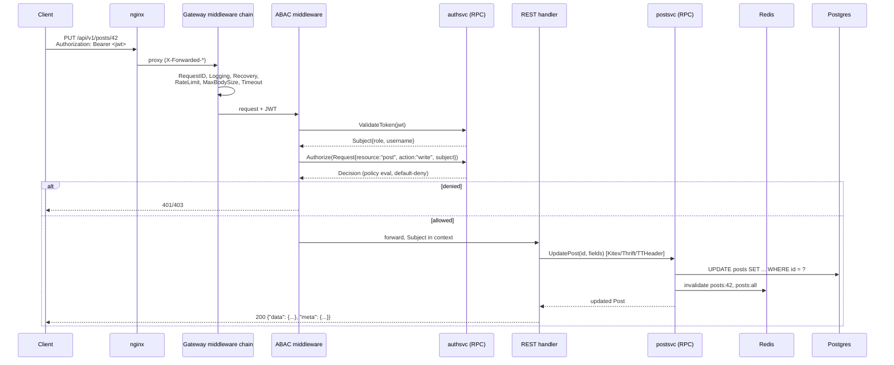
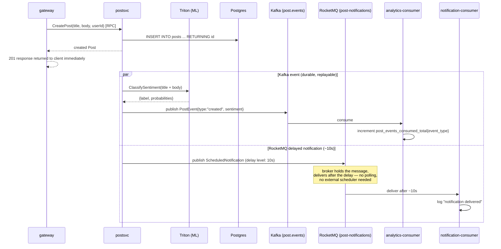
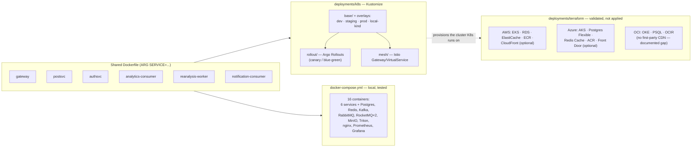

# Architecture

This complements the [README](./README.md)'s ASCII overview with diagrams for the pieces that are easier to follow as a picture: the full component graph, the request lifecycle through ABAC and RPC, the post-creation event fan-out across three message brokers, and how the same six service images map onto Docker Compose vs. Kubernetes vs. the Terraform cloud modules.

## System components

## Request lifecycle: an authenticated write

`PUT /api/v1/posts/{id}` end to end — every mutating request goes through the same ABAC check; the diagram below is representative of any protected route, not special-cased for this one.

## Post creation: fan-out across three brokers

This is the one flow that touches every messaging integration at once, which is why it's worth its own diagram — `PublishPostEvent` and `PublishScheduledRecheck` are both fire-and-forget from the caller's perspective (errors are logged, never fail the CRUD operation that triggered them).

RabbitMQ isn't in this diagram because it belongs to a different flow: `POST /api/v1/posts/reanalyze` enqueues a job onto `reanalysis.jobs`, and `reanalysis-worker` — a competing consumer, not a fan-out subscriber — dequeues and processes it by calling back into `postsvc` over RPC. Three brokers, three different delivery semantics, each matched to what it's actually for (see the README's [Messaging](./README.md#messaging-why-three-brokers) section).

## Deployment topology

The same six service images flow into three different deployment targets. Docker Compose is what's actually run and tested in this repo; Kubernetes and Terraform are structured and validated so a real deployment is a matter of applying them, not designing them from scratch later.

Kubernetes and the Terraform modules were validated directly, not just written and assumed correct: the K8s overlays were applied to a real local `kind` cluster (full auth+CRUD through an installed `ingress-nginx`, a live `kubectl rollout` + `rollout undo`), and each Terraform module was checked with `terraform validate` against its real provider schema (`terraform providers schema -json`), which is what caught real mismatches like OCI's `oci_psql_db_system` needing `subnet_id`/`availability_domain` nested inside a `network_details {}` block rather than at the top level.
