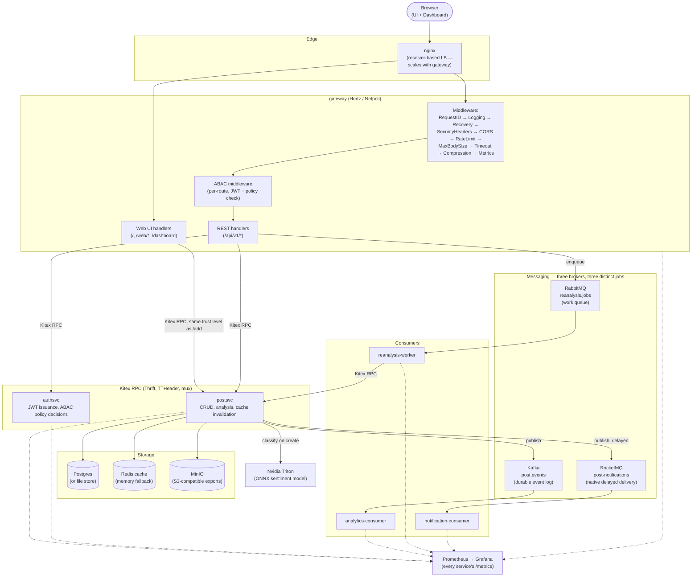
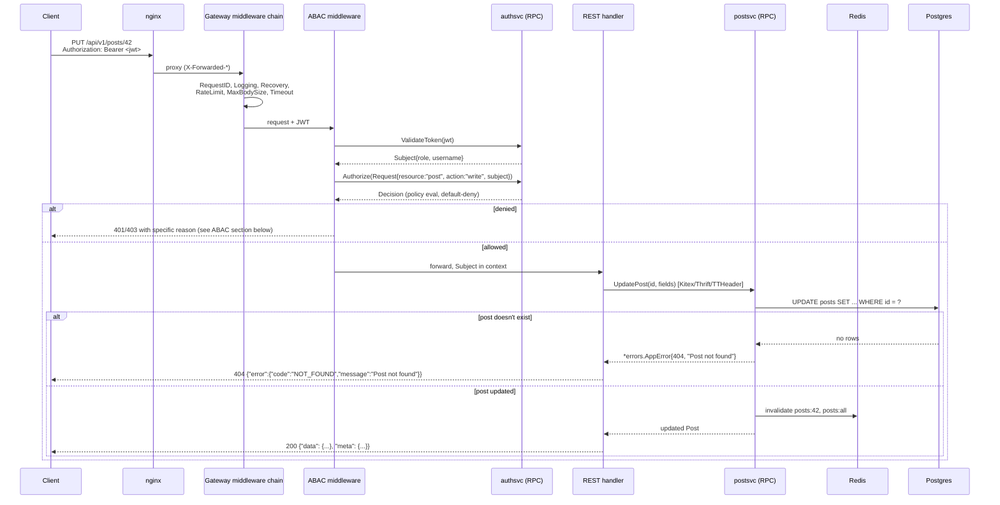
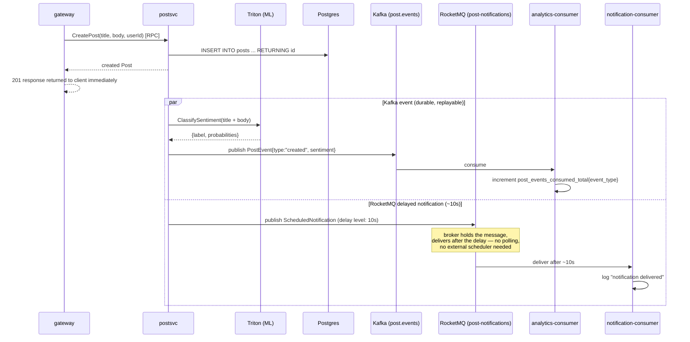
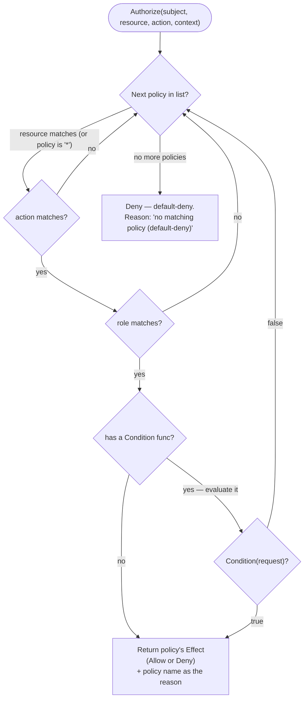
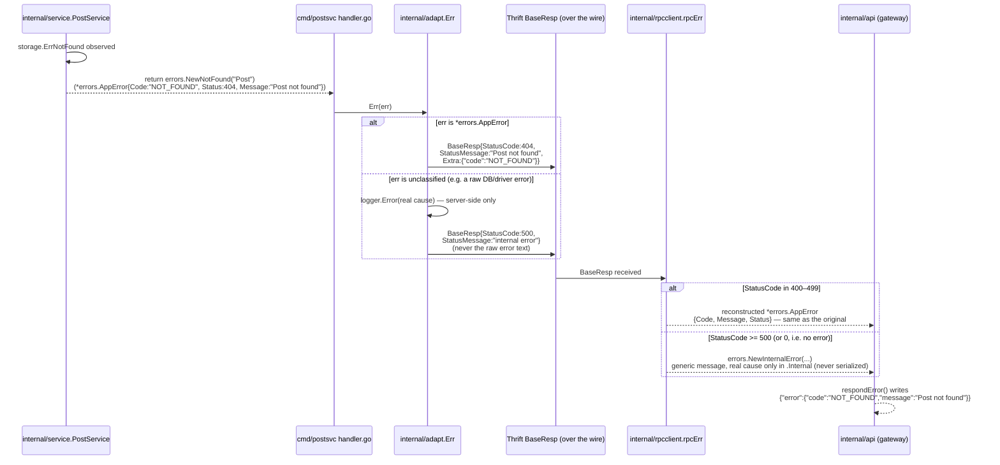
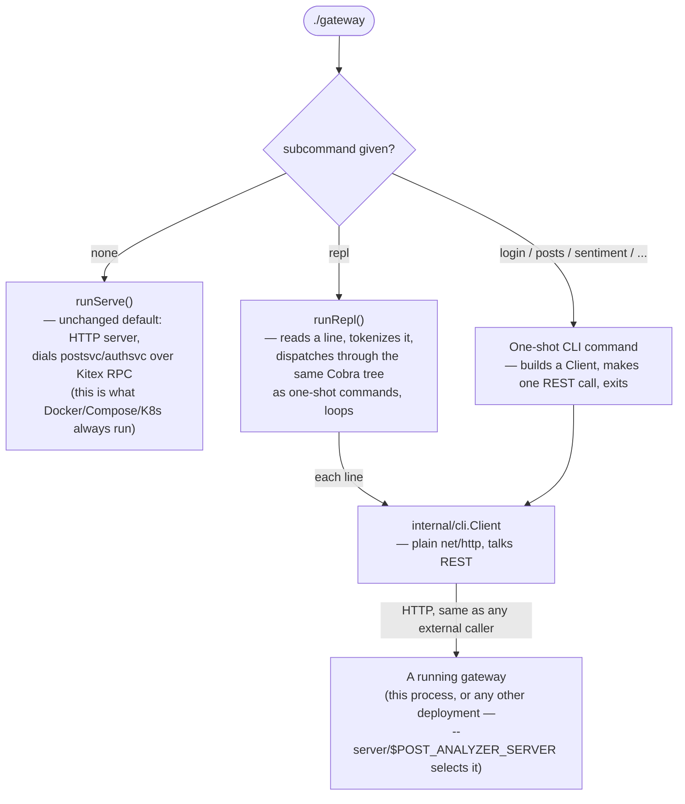
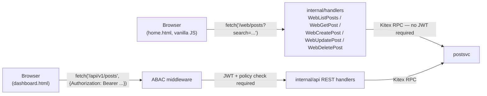
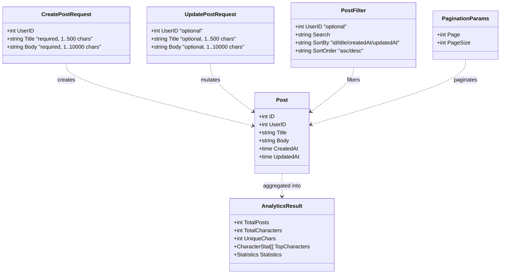
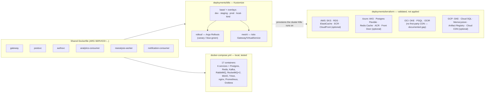

# Architecture

This complements the [README](./README.md)'s quick component overview with diagrams for the pieces that are easier to follow as a picture: the full component graph, the request lifecycle through ABAC and RPC, the post-creation event fan-out across three message brokers, the ABAC policy-evaluation algorithm, how a typed error survives the trip across the Kitex RPC boundary intact, the CLI/REPL architecture, the domain model, and how the same six service images map onto Docker Compose vs. Kubernetes vs. the Terraform cloud modules.

## Table of contents

- [System components](#system-components)
- [Request lifecycle: an authenticated write](#request-lifecycle-an-authenticated-write)
- [Post creation: fan-out across three brokers](#post-creation-fan-out-across-three-brokers)
- [ABAC: policy evaluation](#abac-policy-evaluation)
- [Error propagation: a typed error crossing the RPC boundary](#error-propagation-a-typed-error-crossing-the-rpc-boundary)
- [CLI / REPL: one binary, three modes](#cli--repl-one-binary-three-modes)
- [The web UI's request path](#the-web-uis-request-path)
- [Domain model](#domain-model)
- [Deployment topology](#deployment-topology)
- [Engineering decisions worth knowing about](#engineering-decisions-worth-knowing-about)

## System components

## Request lifecycle: an authenticated write

`PUT /api/v1/posts/{id}` end to end — every mutating request goes through the same ABAC check; the diagram below is representative of any protected route, not special-cased for this one.

## Post creation: fan-out across three brokers

This is the one flow that touches every messaging integration at once, which is why it's worth its own diagram — `PublishPostEvent` and `PublishScheduledRecheck` are both fire-and-forget from the caller's perspective (errors are logged, never fail the CRUD operation that triggered them).

RabbitMQ isn't in this diagram because it belongs to a different flow: `POST /api/v1/posts/reanalyze` enqueues a job onto `reanalysis.jobs`, and `reanalysis-worker` — a competing consumer, not a fan-out subscriber — dequeues and processes it by calling back into `postsvc` over RPC. Three brokers, three different delivery semantics, each matched to what it's actually for (see the README's [Messaging](./README.md#messaging-why-three-brokers) section).

## ABAC: policy evaluation

`internal/abac.Evaluate` is deliberately small: a linear scan over an ordered policy list, first match wins, and **no match means deny**. There's no policy-conflict resolution to reason about because policies are checked in a fixed order and the first applicable one decides — that simplicity is the point for a demo-scale policy set; a larger one would need indexing, but the semantics wouldn't change.

The default policy set (`abac.DefaultPolicies`), evaluated in this order:

| # | Policy | Resource | Action | Role | Effect | Extra condition |
|---|---|---|---|---|---|---|
| 1 | `admin-full-access` | `*` | `*` | `admin` | Allow | — |
| 2 | `editor-delete-requires-mfa` | `post` | `delete` | `editor` | Allow | `context["mfa"] == "true"` (client sends `X-MFA-Verified: true`) |
| 3 | `editor-write` | `post` | `write` | `editor` | Allow | — |
| 4 | `editor-read` | `post` | `read` | `editor` | Allow | — |
| 5 | `viewer-read` | `post` | `read` | `viewer` | Allow | — |
| — | _(no match)_ | | | | **Deny** | Default-deny — this is what a `viewer` hits on `write`/`delete`, and what any role hits on an undefined resource |

`admin` matching policy 1 for everything means an admin's `delete` never even reaches policy 2's MFA condition — first-match-wins, not "most-specific-wins." This is also why an `editor` sending `DELETE` **without** `X-MFA-Verified: true` doesn't get a special "MFA required" error: policy 2's condition fails, evaluation falls through to policy 3 (`write`, not `delete` — doesn't match either) and eventually to default-deny, so the response is the same generic-but-accurate `403` with `"no matching policy (default-deny)"` as any other unauthorized action. The [request-lifecycle diagram](#request-lifecycle-an-authenticated-write) above shows where this plugs into a real request; `middleware.ABAC` (`internal/middleware/auth.go`) is what calls it and turns the `Decision` into an HTTP response.

## Error propagation: a typed error crossing the RPC boundary

Every error surfaced to a client — over `/api/v1`, `/web/*`, the CLI, or the REPL — traces back to the same typed `*errors.AppError` (HTTP status + machine code + safe message) created at the point closest to the actual failure, usually in `internal/service.PostService` or `cmd/authsvc`'s handler. The interesting part is that this survives the Kitex RPC hop between the gateway and `postsvc`/`authsvc` **intact** — a `404` stays a `404`, not a generic `500`, and the real message reaches the client instead of being flattened.

Two things make this safe rather than just convenient:

- **`BaseResp.Extra`** (a `map<string,string>`, previously unused) carries the machine `code` across the wire — no Thrift IDL change was needed, since the field already existed.
- **Only recognized business errors get their message echoed.** An error that isn't a `*errors.AppError` (a SQL driver error, a network failure) is logged server-side and replaced with a generic `"internal error"` / `"Internal server error"` at both hops — the client never sees raw internals, regardless of which service produced the failure.

See the README's [API conventions](./README.md#api-conventions-errors-envelopes-status-codes) section for what this looks like from the outside, endpoint by endpoint.

## CLI / REPL: one binary, three modes

`cmd/gateway`'s `main()` is two lines — `cli.Execute()` — and everything else lives in `internal/cli`. The mode is decided entirely by argv:

The important design choice: the CLI and REPL are **REST clients of `/api/v1`**, not a shortcut into the RPC layer. `internal/cli.Client` builds the exact same HTTP requests `curl` or the dashboard would, which is why `posts get 999` prints the same `"Post not found"` message a browser would see, and why `--server` can point at a completely different deployment — there's no assumption the CLI is running next to the service it's talking to.

## The web UI's request path

`home.html`'s interactive parts (search, sort, paginate, create, edit, delete) talk to `/web/posts*`, a small JSON surface that's **intentionally separate** from `/api/v1`:

Both paths end up at the same `postsvc`, but `/web/*` carries the same trust level as the pre-existing `/add` form post — a convenience surface for the binary's own bundled UI, not a hardened public API. External integrations, the CLI, and the dashboard all use `/api/v1`, which is JWT+ABAC-gated. Both surfaces return the identical `{"error":{"code","message"}}` envelope shape (see [Error propagation](#error-propagation-a-typed-error-crossing-the-rpc-boundary)), so client-side error handling doesn't need to special-case which one it's talking to.

## Domain model

There's one core entity — deliberately: this service does one thing (posts + their analysis), not a general-purpose CMS.

Request DTOs (`CreatePostRequest`/`UpdatePostRequest`) are separate types from `Post` itself, validated before ever reaching the storage layer — a client can't set `ID`/`CreatedAt`/`UpdatedAt` by including them in a request body.

## Deployment topology

The same six service images flow into three different deployment targets. Docker Compose is what's actually run and tested in this repo; Kubernetes and Terraform are structured and validated so a real deployment is a matter of applying them, not designing them from scratch later.

Kubernetes and the Terraform modules were validated directly, not just written and assumed correct: the K8s overlays were applied to a real local `kind` cluster (full auth+CRUD through an installed `ingress-nginx`, a live `kubectl rollout` + `rollout undo`), and each Terraform module was checked with `terraform validate` against its real provider schema (`terraform providers schema -json`), which is what caught real mismatches like OCI's `oci_psql_db_system` needing `subnet_id`/`availability_domain` nested inside a `network_details {}` block rather than at the top level.

## Engineering decisions worth knowing about

Short version of a few choices that aren't obvious from reading the code once, roughly in the order you'd hit them:

- **Compression buffers the full response instead of streaming it.** `internal/middleware.Compression` gzips a complete, already-built response rather than wrapping the live `http.ResponseWriter` in a `gzip.Writer` and streaming through it. The streaming version is the textbook approach for plain `net/http` — but this handler chain runs behind Hertz's net/http compatibility adaptor, and streaming through it produced responses that curl and Go's own `net/http` client reported as truncated (`unexpected EOF` decompressing) for short responses specifically; only a browser's more tolerant network stack papered over it, which is why it went unnoticed until the CLI was exercised against real error responses. Buffering and sending one `Content-Length`-declared write sidesteps the framing interaction entirely — a fine tradeoff for a bounded JSON API response.
- **ABAC is first-match-wins with a hard default-deny**, not a most-specific-rule-wins engine — see [ABAC: policy evaluation](#abac-policy-evaluation). Simpler to reason about at this policy-set size; ordering the list correctly is the operator's responsibility, not something the engine infers.
- **The CLI/REPL are REST clients of `/api/v1`, not a separate RPC-speaking code path.** Keeping them on the same HTTP surface everything else uses means a bug fix or behavior change to the API is automatically visible to the CLI too — there's no second implementation of "how do I call postsvc" to keep in sync.
- **`/web/*` exists as a surface distinct from `/api/v1`** specifically so the bundled UI can offer full CRUD (search/sort/paginate/edit/delete) without requiring every visitor to authenticate — the same trust boundary the original `/add` form already had. It is not meant to be used as a public API; external integrations should use `/api/v1`.
- **Redis failures never fail a request.** `internal/cache` falls back to an in-memory `sync.RWMutex`-protected map when Redis is disabled or unreachable, logged as a warning rather than a startup failure — this is a documented, supported degradation path, not an oversight.
- **RabbitMQ/Kafka/RocketMQ/MinIO/Triton are all optional at startup** for the same reason: a service missing one dependency shouldn't be unable to serve the 95% of functionality that doesn't need it. The dependent endpoints return a clear `503` instead.
