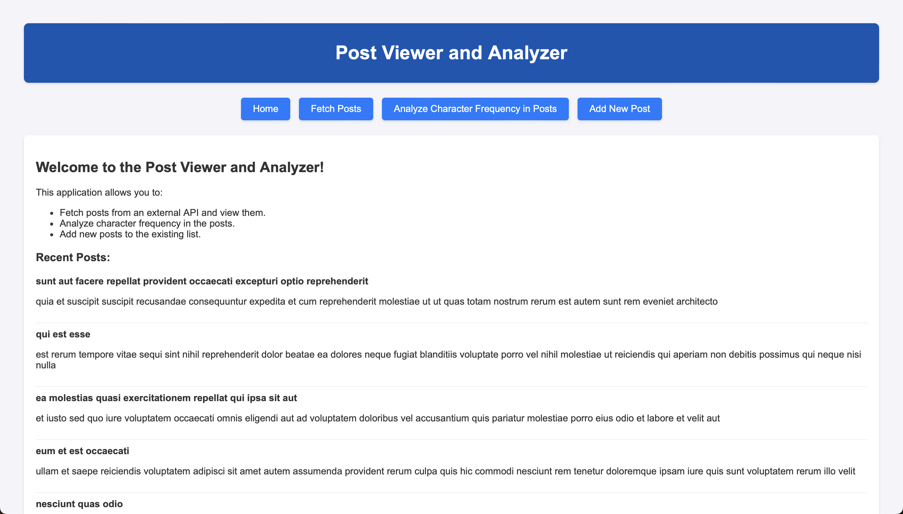
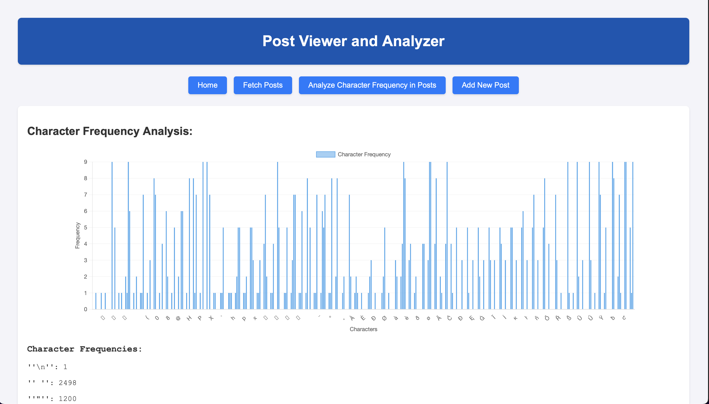

# Post Viewer and Analyzer with Go

<p align="center">
   
</p>

## Introduction
The Post Viewer and Analyzer is a *very* simple web-based application built with Go. It serves a web interface that allows users to fetch posts from the JSONPlaceholder API, save these posts to a file, and perform a character frequency analysis on the saved data. This application demonstrates the use of Go for server-side web development, including handling HTTP requests, processing JSON, and rendering HTML templates.

## Features
- **Fetch Data**: Users can fetch posts from the external JSONPlaceholder API.
- **Save Data**: Automatically saves fetched posts into a local JSON file.
- **Analyze Data**: Performs a character frequency analysis on the contents of the saved JSON file.
- **Web Interface**: Simple and user-friendly web interface to interact with the application.

## Live Deployment

The application is deployed on Render and can be accessed using the following link: [Post Viewer and Analyzer](https://post-analyzer-webserver.onrender.com)

Please note that the application is hosted on a free tier and may take some time to load initially.

## Technology Stack
- **Go**: All server-side logic is implemented in Go, utilizing its standard library for web server functionality, file I/O, and concurrency.
- **HTML/CSS**: Front-end layout and styling.
- **JSONPlaceholder API**: External REST API used for fetching sample post data.

### Why Go?
- **Concurrency**: Go's built-in support for concurrency makes it easy to write efficient and scalable web servers.
- **Standard Library**: Go's standard library provides robust support for web development, including an HTTP server, JSON encoding/decoding, and file I/O.
- **Performance**: Go is known for its fast compilation times and efficient runtime performance, making it a great choice for web applications.
- **Community**: Go has a large and active community, with extensive documentation and libraries available for web development.

### Example Analysis Result

<p align="center">
   
</p>

## Getting Started

### Prerequisites
- Go (version 1.14 or higher recommended)
- Internet connection (for fetching data from the external API)
- Web browser (for accessing the application)

### Installation
1. **Clone the repository:**
   ```
   git clone https://github.com/hoangsonww/Post-Analyzer-Webserver.git
   cd Post-Analyzer-Webserver
   ```

2. **Run the application:**
   ```
   go run main.go
   ```

### Usage
1. **Run the application using the steps mentioned above, do not forget to run `go run main.go`!**
2. **Open your web browser.**
3. **Navigate to `http://localhost:8080/` to access the application.**
4. **Use the following endpoints to interact with the application:**
    - **Home Page**: `/`
    - **Fetch Posts**: `/fetch` - Fetches posts from the JSONPlaceholder and saves them to a local file.
    - **Analyze Character Frequency**: `/analyze` - Analyzes the frequency of each character in the saved posts.
    - **Add Post**: `/add` - Adds a new post to the saved posts.
5. Because it is currently a Backend-focus application, you can greatly enhanced it by adding a polished Frontend to it, such as by using React.js.

## Application Structure
- **main.go**: Contains all the server-side logic including API calls, concurrency handling, file operations, and web server setup.
- **home.html**: HTML template file used for rendering the web interface.
- **go.mod**: Go module file that defines the project's dependencies.
- **posts.json**: Local JSON file used to store the fetched posts.

## Contributing
Contributions are what make the open-source community such an amazing place to learn, inspire, and create. Any contributions you make are **greatly appreciated**.

1. Fork the Project
2. Create your Feature Branch (`git checkout -b feature/AmazingFeature`)
3. Commit your Changes (`git commit -m 'Add some AmazingFeature'`)
4. Push to the Branch (`git push origin feature/AmazingFeature`)
5. Open a Pull Request

## License
Distributed under the MIT License. See `LICENSE` for more information.

## Contact
Son Nguyen - [https://github.com/hoangsonww](https://github.com/hoangsonww)  

## Acknowledgements
- [Go](https://golang.org/)
- [JSONPlaceholder](https://jsonplaceholder.typicode.com/)
  
---


---

Created with ❤️ by [Son Nguyen](https://github.com/hoangsonww) in 2024.
