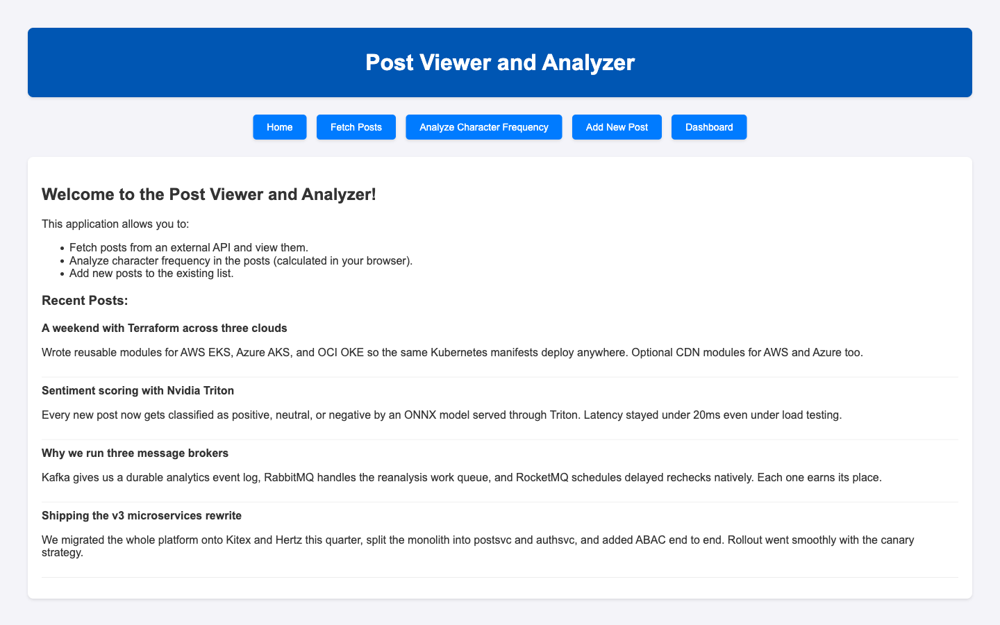

# Post Analyzer Webserver - Production Ready

<p align="center">
   
</p>

<p align="center">
   
   
   
   
   
</p>

## Overview

A **production-ready** web application built with Go for analyzing and managing posts. This application demonstrates enterprise-grade software development practices including microservices patterns, observability, security, and DevOps best practices.

## Features

### Core Features
- 📝 **Post Management**: Create, read, update, and delete posts
- 🔍 **Character Analysis**: Concurrent character frequency analysis with visualization
- 🌐 **External API Integration**: Fetch posts from JSONPlaceholder API
- 💾 **Flexible Storage**: Support for both file-based and PostgreSQL storage

### Production Features
- 🔒 **Security**: Input validation, XSS protection, security headers, rate limiting
- 📊 **Observability**: Structured logging, Prometheus metrics, health checks
- 🚀 **Performance**: Graceful shutdown, request timeouts, connection pooling
- 🔄 **DevOps**: Docker support, CI/CD pipeline, automated testing
- 🛡️ **Reliability**: Panic recovery, error handling, request tracing
- ⚙️ **Configuration**: Environment-based config with validation

## Architecture

```
┌─────────────────────────────────────────────────────────┐
│                     Load Balancer                        │
└─────────────────────────────────────────────────────────┘
                            │
┌─────────────────────────────────────────────────────────┐
│                   Middleware Stack                       │
│  ┌──────────┬──────────┬──────────┬──────────────────┐ │
│  │ Request  │ Logging  │ Recovery │ Security Headers │ │
│  │   ID     │          │          │                  │ │
│  └──────────┴──────────┴──────────┴──────────────────┘ │
│  ┌──────────┬──────────┬──────────┬──────────────────┐ │
│  │   CORS   │   Rate   │ Body     │    Metrics       │ │
│  │          │ Limiting │ Limit    │                  │ │
│  └──────────┴──────────┴──────────┴──────────────────┘ │
└─────────────────────────────────────────────────────────┘
                            │
┌─────────────────────────────────────────────────────────┐
│                   HTTP Handlers                          │
│  ┌──────────┬──────────┬──────────┬──────────────────┐ │
│  │  Health  │  Posts   │ Analysis │    Metrics       │ │
│  └──────────┴──────────┴──────────┴──────────────────┘ │
└─────────────────────────────────────────────────────────┘
                            │
┌─────────────────────────────────────────────────────────┐
│                  Storage Layer                           │
│  ┌──────────────────────┬──────────────────────────────┐│
│  │   File Storage       │   PostgreSQL Storage         ││
│  └──────────────────────┴──────────────────────────────┘│
└─────────────────────────────────────────────────────────┘
```

## Technology Stack

- **Backend**: Go 1.21+
- **Database**: PostgreSQL 16 (with file storage fallback)
- **Monitoring**: Prometheus + Grafana
- **Containerization**: Docker + Docker Compose
- **CI/CD**: GitHub Actions
- **Template Engine**: Go html/template
- **Metrics**: Prometheus client
- **Testing**: Go testing + table-driven tests

## Quick Start

### Prerequisites

- Go 1.21 or higher
- Docker and Docker Compose (optional)
- PostgreSQL 16 (if not using Docker)
- Make (optional, for convenience commands)

### Using Docker (Recommended)

```bash
# Clone the repository
git clone https://github.com/hoangsonww/Post-Analyzer-Webserver.git
cd Post-Analyzer-Webserver

# Start all services
make docker-up

# Or without Make
docker-compose up -d
```

The application will be available at:
- **Application**: http://localhost:8080
- **Prometheus**: http://localhost:9090
- **Grafana**: http://localhost:3000 (admin/admin)

### Local Development

```bash
# Install dependencies
make install

# Run with file storage
go run ./cmd/gateway

# Run with PostgreSQL
export DB_TYPE=postgres
export DB_HOST=localhost
export DB_PASSWORD=yourpassword
go run ./cmd/gateway

# Or use Make
make run
```

## Configuration

The application is configured via environment variables. See `.env.example` for all available options:

```bash
# Copy example configuration
cp .env.example .env

# Edit configuration
nano .env
```

### Key Configuration Options

| Variable | Default | Description |
|----------|---------|-------------|
| `PORT` | 8080 | Server port |
| `ENVIRONMENT` | development | Environment (development/staging/production) |
| `DB_TYPE` | file | Storage type (file/postgres) |
| `LOG_LEVEL` | info | Logging level (debug/info/warn/error) |
| `RATE_LIMIT_REQUESTS` | 100 | Max requests per window |
| `ALLOWED_ORIGINS` | * | CORS allowed origins |

## API Endpoints

### Health & Monitoring

| Endpoint | Method | Description |
|----------|--------|-------------|
| `/health` | GET | Health check endpoint |
| `/readiness` | GET | Readiness probe |
| `/metrics` | GET | Prometheus metrics |

### Application

| Endpoint | Method | Description |
|----------|--------|-------------|
| `/` | GET | Home page with all posts |
| `/fetch` | GET | Fetch posts from external API |
| `/add` | GET/POST | Add new post form/submit |
| `/analyze` | GET | Character frequency analysis |

See [api-docs.yaml](api-docs.yaml) for complete OpenAPI documentation.

## Development

### Running Tests

```bash
# Run all tests
make test

# Run with coverage
make test-coverage

# Run benchmarks
make benchmark
```

### Code Quality

```bash
# Format code
make format

# Run linter
make lint

# Run security checks
make security

# Run all checks
make check
```

### Database Management

```bash
# Connect to database shell
make db-shell

# Run migrations (automatic on startup)
make migrate
```

## Deployment

### Docker Deployment

```bash
# Build Docker image
make docker-build

# Deploy with Docker Compose
make docker-up
```

### Production Deployment

1. **Build for production**:
   ```bash
   make prod-build
   ```

2. **Set environment variables**:
   ```bash
   export ENVIRONMENT=production
   export DB_TYPE=postgres
   export DB_HOST=your-db-host
   export DB_PASSWORD=your-db-password
   ```

3. **Run the application**:
   ```bash
   ./post-analyzer
   ```

### Cloud Platforms

#### Render.com
1. Create a new Web Service
2. Connect your GitHub repository
3. Set build command: `go build -o app ./cmd/gateway`
4. Set start command: `./app`
5. Add environment variables

#### Heroku
```bash
heroku create your-app-name
heroku addons:create heroku-postgresql:hobby-dev
git push heroku main
```

#### AWS ECS/Fargate
```bash
# Build and push Docker image
docker build -t post-analyzer .
docker tag post-analyzer:latest YOUR_ECR_REPO/post-analyzer:latest
docker push YOUR_ECR_REPO/post-analyzer:latest

# Deploy using ECS/Fargate
aws ecs update-service --cluster your-cluster --service post-analyzer --force-new-deployment
```

## Monitoring & Observability

### Metrics

The application exposes Prometheus metrics at `/metrics`:

- **HTTP Metrics**: Request count, duration, size
- **Application Metrics**: Posts count, operations
- **Database Metrics**: Query duration, connection pool
- **Analysis Metrics**: Analysis operations and duration

### Logging

Structured JSON logging with contextual information:

```json
{
  "time": "2025-01-16T10:30:00Z",
  "level": "INFO",
  "msg": "request completed",
  "request_id": "550e8400-e29b-41d4-a716-446655440000",
  "method": "GET",
  "path": "/",
  "status": 200,
  "duration_ms": 45
}
```

### Grafana Dashboards

Access Grafana at http://localhost:3000 (when using Docker Compose):
- Username: `admin`
- Password: `admin`

Import the included dashboard for visualization of:
- Request rate and latency
- Error rates
- Database performance
- Resource utilization

## Security

### Implemented Security Measures

- ✅ Input validation and sanitization
- ✅ XSS protection
- ✅ Security headers (CSP, X-Frame-Options, etc.)
- ✅ Rate limiting
- ✅ CORS configuration
- ✅ Panic recovery
- ✅ Request timeouts
- ✅ Body size limits
- ✅ SQL injection prevention (prepared statements)

### Security Best Practices

1. **Never commit secrets**: Use environment variables
2. **Update dependencies regularly**: `make deps-update`
3. **Run security scans**: `make security`
4. **Use HTTPS in production**: Configure reverse proxy
5. **Review logs regularly**: Monitor for suspicious activity

## Performance

### Optimizations

- **Concurrent processing**: Character analysis uses goroutines
- **Connection pooling**: Database connection reuse
- **Graceful shutdown**: No request interruption
- **Request timeouts**: Prevent resource exhaustion
- **Efficient JSON parsing**: Streaming decoder

### Benchmarks

Run benchmarks to measure performance:

```bash
make benchmark
```

## CI/CD Pipeline

GitHub Actions workflow includes:

1. **Lint**: Code quality checks
2. **Test**: Unit and integration tests with coverage
3. **Build**: Binary compilation
4. **Security**: Vulnerability scanning
5. **Docker**: Image building and pushing
6. **Deploy**: Automated deployment (configurable)

## Project Structure

```
Post-Analyzer-Webserver/
├── config/               # Configuration management
│   └── config.go
├── internal/            # Internal packages
│   ├── handlers/        # HTTP handlers
│   ├── logger/          # Structured logging
│   ├── metrics/         # Prometheus metrics
│   ├── middleware/      # HTTP middleware
│   └── storage/         # Storage layer (file, postgres)
├── .github/
│   └── workflows/       # CI/CD pipelines
├── assets/              # Static assets
├── cmd/gateway/main.go  # Application entry point (HTTP/CLI/REPL)
├── home.html            # HTML template
├── Dockerfile           # Docker image definition
├── docker-compose.yml   # Multi-container setup
├── Makefile             # Development commands
├── api-docs.yaml        # OpenAPI specification
└── README.md            # This file
```

## Troubleshooting

### Common Issues

**Application won't start**
```bash
# Check logs
docker-compose logs app

# Verify configuration
go run ./cmd/gateway  # Will show config validation errors
```

**Database connection failed**
```bash
# Check PostgreSQL is running
docker-compose ps

# Test connection
make db-shell
```

**Rate limit errors**
```bash
# Increase rate limit
export RATE_LIMIT_REQUESTS=1000
```

## Contributing

We welcome contributions! Please follow these steps:

1. Fork the repository
2. Create a feature branch (`git checkout -b feature/amazing-feature`)
3. Make your changes
4. Run tests (`make check`)
5. Commit your changes (`git commit -m 'Add amazing feature'`)
6. Push to the branch (`git push origin feature/amazing-feature`)
7. Open a Pull Request

### Development Guidelines

- Follow Go best practices and idioms
- Write tests for new features
- Update documentation
- Ensure all checks pass (`make check`)
- Use conventional commits

## Roadmap

- [ ] REST API for programmatic access
- [ ] GraphQL API support
- [ ] User authentication and authorization
- [ ] Multi-user support
- [ ] Advanced analytics dashboard
- [ ] Export functionality (CSV, PDF)
- [ ] Real-time updates with WebSockets
- [ ] Mobile app (React Native)
- [ ] Kubernetes deployment manifests
- [ ] Terraform infrastructure as code

## License

Distributed under the MIT License. See `LICENSE` for more information.

## Acknowledgements

- [Go](https://golang.org/)
- [JSONPlaceholder](https://jsonplaceholder.typicode.com/)
- [Prometheus](https://prometheus.io/)
- [PostgreSQL](https://www.postgresql.org/)
- [Docker](https://www.docker.com/)

## Support

For support, please:
- 📧 Open an issue on GitHub
- 💬 Start a discussion
- 📖 Check the documentation

## Contact

Son Nguyen - [@hoangsonww](https://github.com/hoangsonww)

Project Link: [https://github.com/hoangsonww/Post-Analyzer-Webserver](https://github.com/hoangsonww/Post-Analyzer-Webserver)

Live Demo: [https://post-analyzer-webserver.onrender.com](https://post-analyzer-webserver.onrender.com)

---

Created with ❤️ by [Son Nguyen](https://github.com/hoangsonww) in 2024-2025.
